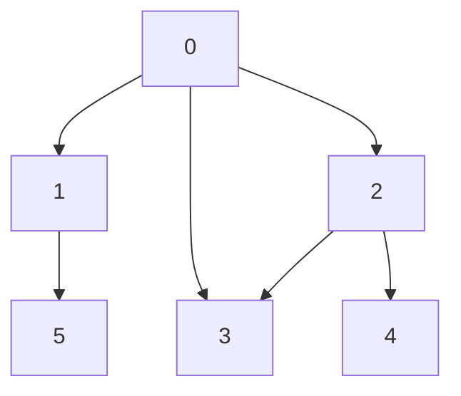

# How it works
## Process
1. Traverse to next node in the queue. 
2. Queue all unvisited neighbours of the current node.

## Examples
input: adj[][] = [[1, 2], [0, 5], [0, 3, 4], [0, 2], [2]]

Queue: [0].
Visited: [].

**a**
1. Traverse to node 0.
2. Queue unvisited neighbours [1, 2].

Queue: [1, 2].

Visited: [0].

**b** 
1. Traverse to node 1.
2. Queue unvisited neighbours [5].

Queue: [2, 5].

Visited: [0, 1].

**c**
1. Traverse to node 2.
2. Queue unvisited neighbours [3, 4].

Queue: [5, 3, 4].

Visited: [0, 1, 2].

**d**
1. Traverse to node 5.
2. Queue unvisited neighbours [].

Queue: [3, 4].

Visited: [0, 1, 2, 5].

**e**
1. Traverse to node 3.
2. Queue unvisited neighbours [].

Queue: [4].

Visited: [0, 1, 2, 5, 3].

**f**
1. Traverse to node 4.
2. Queue unvisited neighbours [].

Queue: [].

Visited: [0, 1, 2, 5, 3, 4].

# Sources
[Geeks for Geeks](https://www.geeksforgeeks.org/breadth-first-search-or-bfs-for-a-graph/)
