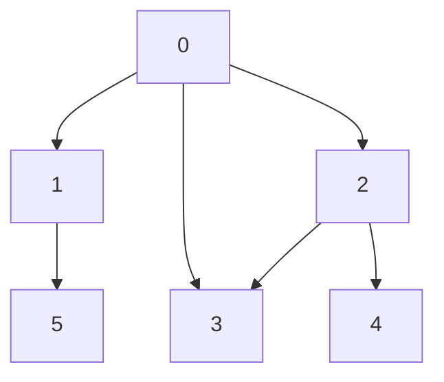

# How it works
# Process
1. Pop a node and traverse to that node.
2. Push all unvisited neighbours to the stack
# Examples
input: adj[][] = [[1, 2], [0, 5], [0, 3, 4], [0, 2], [2]]

Stack: [0]

Visited:[]

**a**
1. Pop 0 and traverse to 0.
2. Push [1, 2] to stack.

Stack: [2, 1].

Visited: [0].

**b**
1. Pop 1 and traverse to 1.
2. Push [5] to stack.

Stack: [2, 5].

Visited: [0, 1].

**c**
1. Pop 5 and traverse to 5.
2. Push [] to stack.

Stack: [2].

Visited: [0, 1, 5].

**d**
1. Pop 2 and traverse to 2.
2. Push [3, 4] to stack.

Stack: [3, 4].

Visited: [0, 1, 5, 2].

**e**
1. Pop 4 and traverse to 4.
2. Push [] to stack.

Stack: [3].

Visited: [0, 1, 5, 2, 4].

**f**
1. Pop 3 and traverse to 3.
2. Push [] to stack.

Stack: [].

Visited: [0, 1, 5, 2, 4, 3].

# Sources
[Geeks for Geeks](https://www.geeksforgeeks.org/depth-first-search-or-dfs-for-a-graph/)
